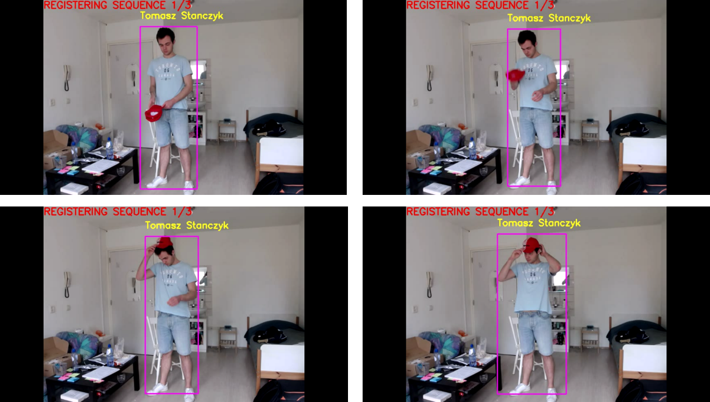
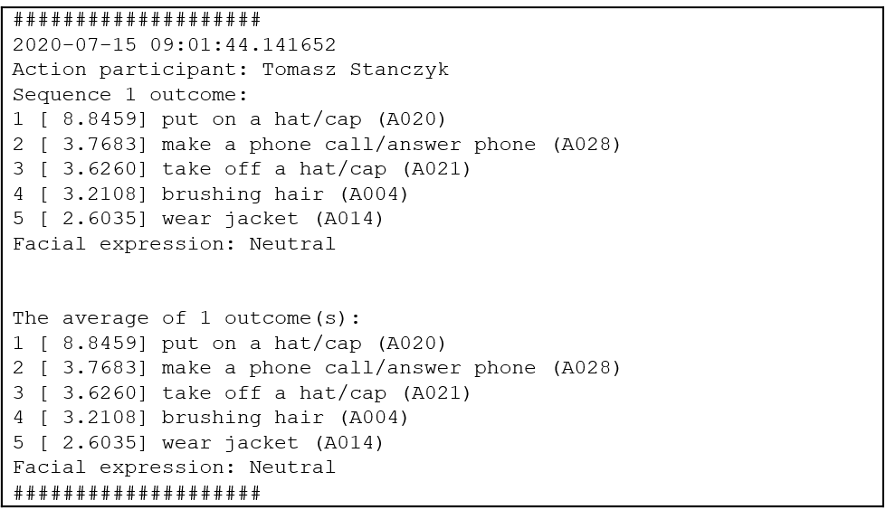
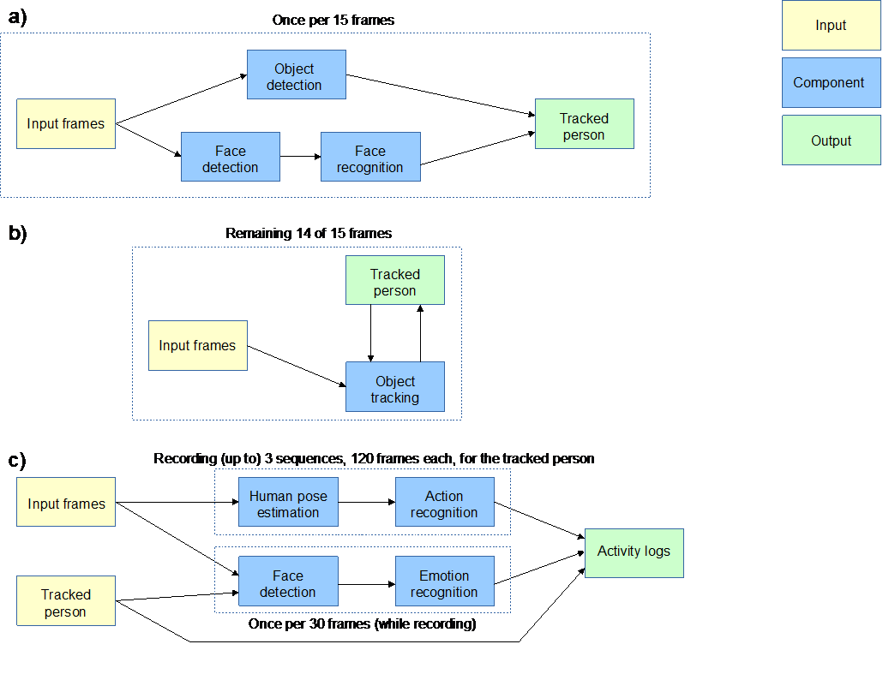

# HumanRecognitionBehaviorAnalysis
An integrated computer vision system for human recognition and behavior analysis from RGB Camera. Project realized within the master studies internship.

## Components
This system was created using the state-of-the-art computer vision components based on the following repositories:
*   object detection - [PyTorch YOLOv3](https://github.com/eriklindernoren/PyTorch-YOLOv3),
*   face detection - [Dlib's CNN-based face detection model](http://dlib.net/python/index.html#dlib.cnn_face_detection_model_v1),
*   face recognition - [Dlib's face recognition model](http://dlib.net/python/index.html#dlib.face_recognition_model_v1),
*   object tracking - [Dlib's correlation tracker](http://dlib.net/python/index.html#dlib.correlation_tracker),
*   facial emotion recognition - [Facial-Expression-Recognition.Pytorch](https://github.com/WuJie1010/Facial-Expression-Recognition.Pytorch),
*   human pose estimation - [lightweight-human-pose-estimation.pytorch](https://github.com/Daniil-Osokin/lightweight-human-pose-estimation.pytorch),
*   skeleton-based action recognition - [2s-AGCN (MS-AAGCN)](https://github.com/lshiwjx/2s-AGCN).

The skeleton-based action recognition component was modified and expanded into practically usable component. The whole pipeline extracting skeletons human pose skeletons from RGB video was created:

The skeleton-based action recognition component was trained on the custom 2D skeleton dataset. Using the same approach with [Lightweight OpenPose](https://github.com/Daniil-Osokin/lightweight-human-pose-estimation.pytorch) as for the action recognition pipeline, 2D skeletons were extracted from RGB videos coming from the original [NTU-RGB+D dataset](http://rose1.ntu.edu.sg/datasets/actionrecognition.asp). First 60 classes (A001-A060) were taken into account. 
<!-- The derived datasets will be released soon upon the agreement from the authors of the original dataset -->
 
All the components were integrated into one system as presented below:

For more details about the components and the system functionality, please check [internship presentation](extra_materials/presentation.pdf) and [abstract](extra_materials/abstract.pdf).

## How to run the program
An RGB camera is required. 
The following packages need to be installed, with the newest versions recommended:
*   pytorch (torch)
*   torchvision
*   h5py
*   sklearn
*   pycocotools
*   opencv-python
*   numpy
*   matplotlib
*   terminaltables
*   pillow
*   tqdm
*   dlib (with GPU support)
*   argparse
*   PIL
*   imutils
 
As described in [PyTorch YOLOv3 installation guidelines](https://github.com/eriklindernoren/PyTorch-YOLOv3/blob/master/README.md#download-pretrained-weights),

##### download pretrained weights :
    $ cd pytorch_yolo_adapted/weights
    $ bash download_weights.sh
    
##### and download COCO:
    $ cd pytorch_yolo_adapted/data
    $ bash get_coco_dataset.sh
 
Following [the guidlines of Facial-Expression-Recognition.Pytorch](https://github.com/WuJie1010/Facial-Expression-Recognition.Pytorch#visualize-for-a-test-image-by-a-pre-trained-model), create a new folder: facial_recognition_pytorch_adapted/FER2013_VGG19, download the pre-trained model from [link1](https://drive.google.com/open?id=1Oy_9YmpkSKX1Q8jkOhJbz3Mc7qjyISzU) or [link2 (key: g2d3)](https://pan.baidu.com/s/1gCL0TlCwKctAy_5yhzHy5Q)) and place it in the FER2013_VGG19 folder. 
Further, download [Dlib's human face detector model](http://dlib.net/python/index.html#dlib.cnn_face_detection_model_v1) as well as [Dlib's shape predictor](https://github.com/davisking/dlib-models/blob/master/shape_predictor_5_face_landmarks.dat.bz2), unpack both files and place them inside facial_recognition_pytorch_adapted)
  
As described in [lightweight-human-pose-estimation.pytorch installation guidelines](https://github.com/Daniil-Osokin/lightweight-human-pose-estimation.pytorch#pre-trained-model-), download the pre-trained model from [link](https://download.01.org/opencv/openvino_training_extensions/models/human_pose_estimation/checkpoint_iter_370000.pth) and place it in lightweight_openpose_adapted/models.
  
Finally, 

