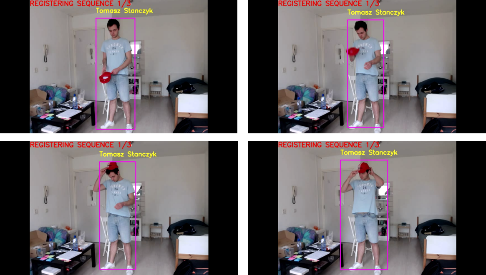

# HumanRecognitionBehaviorAnalysis
An integrated computer vision system for human recognition and behavior analysis from RGB Camera. Project realized within the master studies internship.

## Components
This system has been created using the state-of-the-art computer vision components based on the following repositories:
<ul>
  <li>object detection - [PyTorch YOLOv3](https://github.com/eriklindernoren/PyTorch-YOLOv3) </li>
  <li>face detection - </li>
  <li>face recognition - </li>
  <li>object tracking - </li>
  <li>facial emotion recognition - </li>
  <li>human pose estimation - </li>
  <li>skeleton-based action recognition - </li>
</ul>
